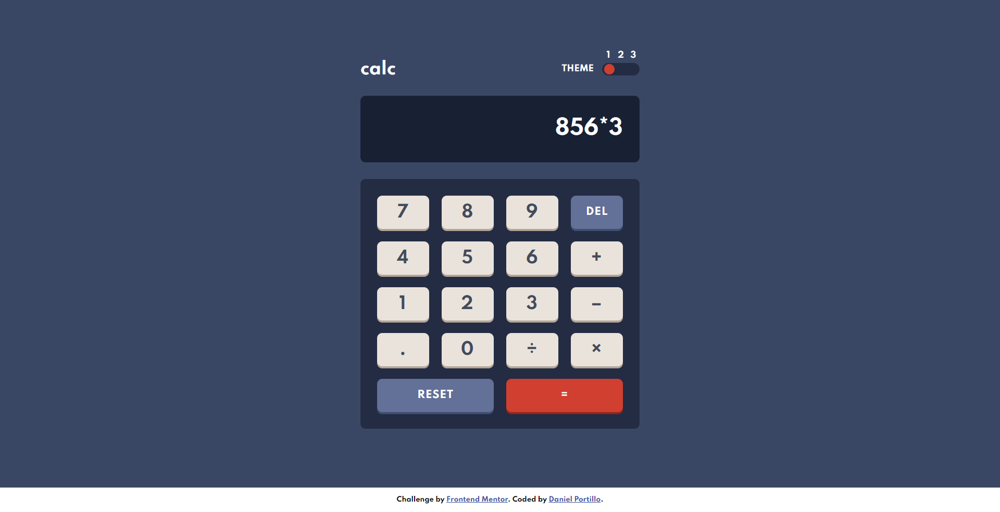
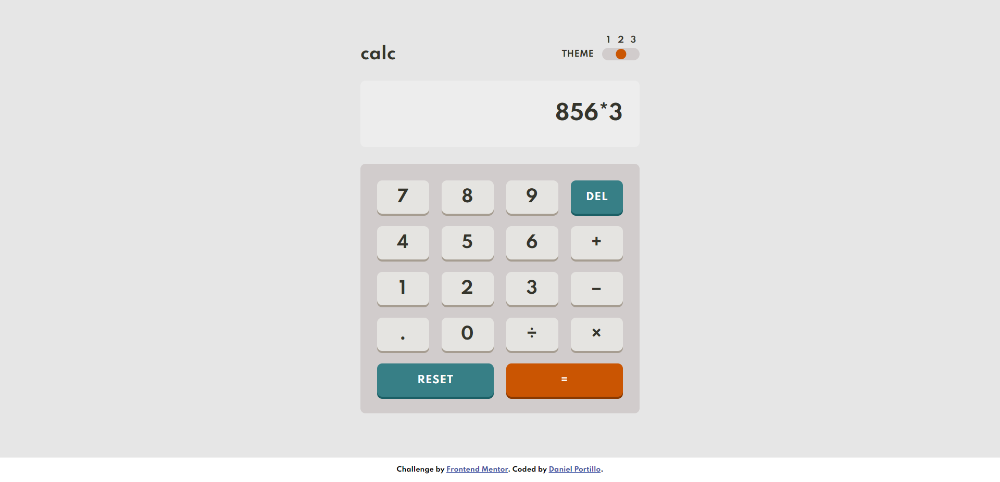
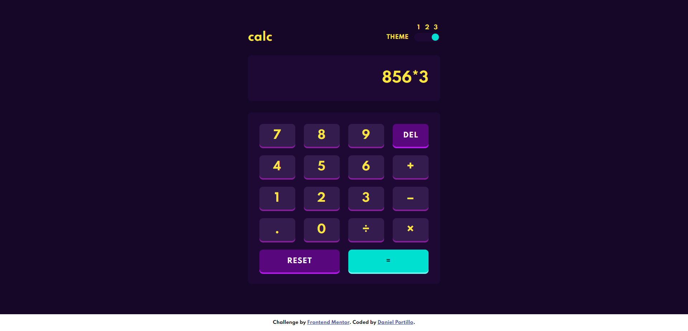
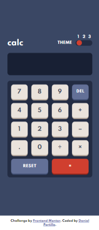
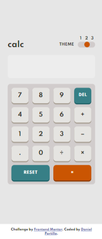
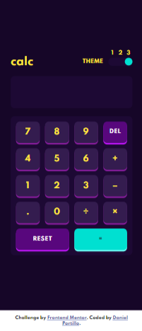

# Frontend Mentor - Calculator app solution

This is a solution to the [Calculator app challenge on Frontend Mentor](https://www.frontendmentor.io/challenges/calculator-app-9lteq5N29). Frontend Mentor challenges help you improve your coding skills by building realistic projects. 

## Table of contents

- [Overview](#overview)
  - [The challenge](#the-challenge)
  - [Screenshot](#screenshot)
    - [Desktop](#Desktop)
    - [Mobile](#Mobile)
  - [Links](#links)
- [My process](#my-process)
  - [Built with](#built-with)
  - [What I learned](#what-i-learned)
  - [Continued development](#continued-development)
  - [Useful resources](#useful-resources)
- [Author](#author)

## Overview

### The challenge

Users should be able to:

- See the size of the elements adjust based on their device's screen size
- Perform mathmatical operations like addition, subtraction, multiplication, and division
- Adjust the color theme based on their preference
- **Bonus**: Have their initial theme preference checked using `prefers-color-scheme` and have any additional changes saved in the browser

### Screenshot

#### Desktop




#### Mobile (Screenshots using iPhone X size)





### Links

- Solution URL: [Frontendmentor Solution link](https://www.frontendmentor.io/solutions/desktop-first-using-sass-and-react-dFBaNj2-s)
- Live Site URL: [Calculator app live site](https://dportillo23.github.io/calculator-app/)

## My process

### Built with

- [React](https://reactjs.org/) - JS library
- SASS
- CSS Variables
- CSS Grid
- Desktop-first workflow


### What I learned

This was my first ever project using react, it was a very interesting project and I struggle a bit with the toggle and making it work changing the themes.

Below you can find the toggle component code snippet and the function to delete a space:

```jsx
function Toggle() {
    const body = document.body;

    var pageState = localStorage.getItem("pageState")
    if (pageState === null) {
        body.className = "Theme-1"
    } else {
        body.className = pageState
    }


    const changeTheme = (e) => {
        body.className = e.target.value
    }

    const savePageState = (e) => {
        pageState =  e.target.value
        console.log("This is the theme saved " + e.target.value);
        localStorage.setItem("pageState", pageState)
        console.log("This is the updated pageState" + pageState);
    }

    const onChangeFunc = (e) => {
        changeTheme(e);
        savePageState(e);
    }

    return (
        <div className="radio-wrapper">
            <input type="radio" defaultChecked={pageState === "Theme-1" ? true : false} name="theme" value="Theme-1" className="theme-1" id="radio-1" onChange={onChangeFunc} />
            <label for="radio-1">1</label>

            <input type="radio" defaultChecked={pageState === "Theme-2" ? true : false} name="theme" value="Theme-2" className="theme-2" id="radio-2" onChange={onChangeFunc} />
            <label for="radio-2">2</label>

            <input type="radio" defaultChecked={pageState === "Theme-3" ? true : false} name="theme" value="Theme-3" className="theme-3" id="radio-3" onChange={onChangeFunc} />
            <label for="radio-3">3</label>

            <div className="selector">&nbsp;</div>

        </div>)
```

```jsx
const backSpace = () => {
    if (display.secondOperand) {
      setDisplay(prevDisplay => {
        return ({
          ...prevDisplay,
          secondOperand: display.secondOperand.slice(0, -1)
        })
      })
    } else if (display.operator) {
      setDisplay(prevDisplay => {
        return ({
          ...prevDisplay,
          operator: display.operator.slice(0, -1)
        })
      })
    } else {
      setDisplay(prevDisplay => {
        return ({
          ...prevDisplay,
          firstOperand: display.firstOperand.slice(0, -1)
        })
      })
    }
  }
}
```

Eventhough it is a simple scss, it was the first time I used mixins and I'm proud of my small mixin for the calculator buttons:

```Scss
@mixin btn($back-color, $text-color, $shadow-color, $size, $padding) {
    border: none;
    display: flex;
    align-items: center;
    justify-content: center;
    border-radius: 10px;
    background-color: $back-color;
    color: $text-color;
    box-shadow: 0px 4px $shadow-color;
    width: 100%;
    height: 4rem;
    font-size: $size;
    padding: $padding;

    &:focus {
        outline: none;
    }
}
```
### Continued development

React is still a whole new world for me, in this project I used hooks for the screen and is still something I need to practice more. Further, I think controlled inputs would be great and I need to practice them, I used uncontrolled ones for this task

### Useful resources

- [Digital Solutions Master](https://www.youtube.com/watch?v=hpfDRnijdPE) - It helped me to have a general idea of the calculator app and how it could be done with react.
- [Self Teach Me - CSS Toggle Switch](https://www.youtube.com/watch?v=LVPmYBgBdeM) - Awesome video, very detail explanation and answering common mistakes you can make. I'd recommend it to anyone who needs to make a 3 state toggle switch.
- [Angela Yu - The Complete Web Development Bootcamp](https://www.udemy.com/course/the-complete-web-development-bootcamp) - Angela Yu has an extraordinary web development bootcamp. She added recently a section of React, it was very helpful to rewatch some of the videos in the React section to perform this task.

## Author

- Website - [Daniel Portillo](https://dportillo23.github.io/My-Personal-Site/)
- Frontend Mentor - [@dportillo23](https://www.frontendmentor.io/profile/dportillo23)
- GitHub- [dportillo23](https://github.com/dportillo23)
